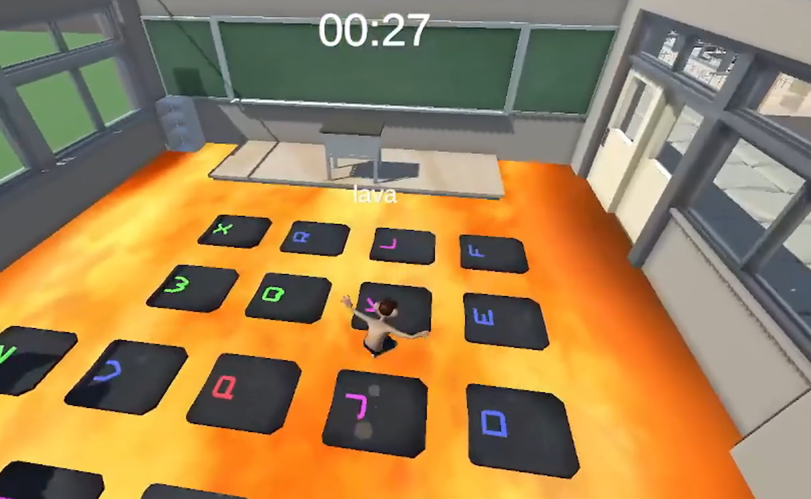
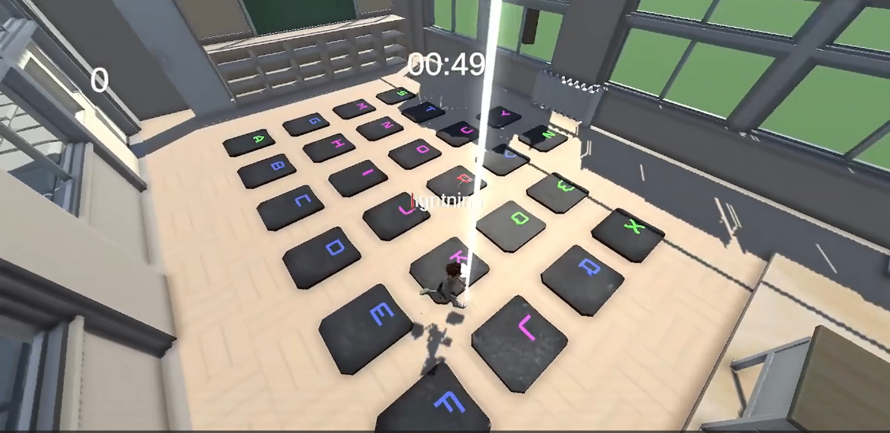
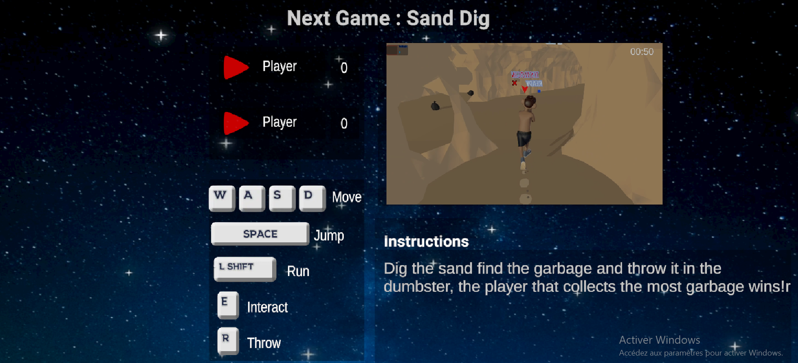
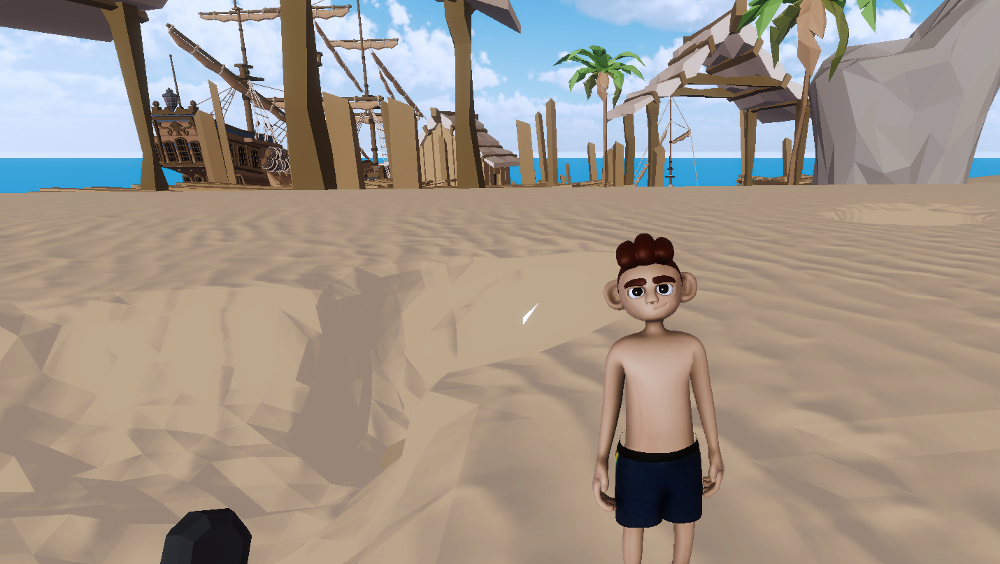
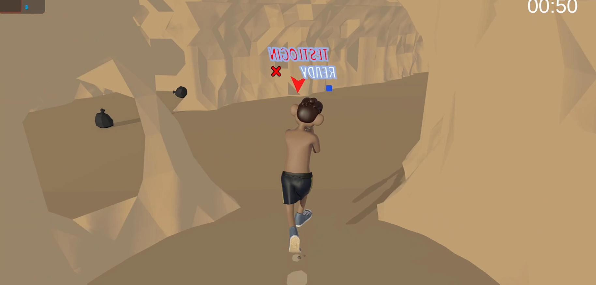
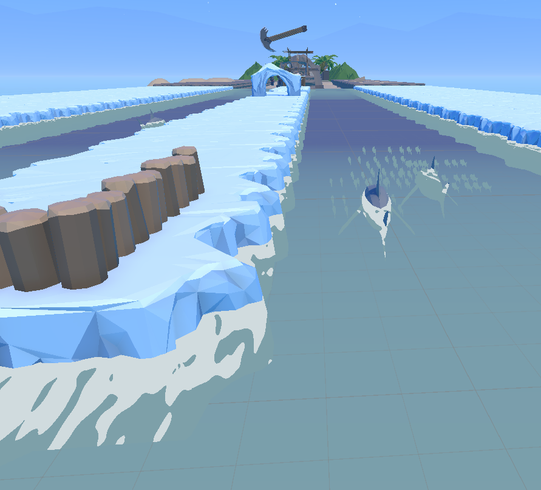

# BioBrawlers 🌍🎮
BioBrawlers is an exciting multiplayer game developed to combine fun with learning, revolving around the themes of Sustainable Development Goals (SDGs). It was built with a Node.js backend, Unity and C# frontend, and features user authentication, 
login systems, and the ability to join either private lobbies or public games. The game features a variety of mini-games where you compete with friends to achieve environmental and community-related objectives. Whether you're cleaning up beaches,
delivering electricity, or racing through seasons, BioBrawlers offers engaging gameplay with a twist!

## 🛠️ About the Game
BioBrawlers is a collection of mini-games designed around the concept of sustainability and SDGs. Players can either create a private lobby or join an existing public one. Each mini-game has unique mechanics and challenges, promoting friendly 
competition with a fun educational spin. The gameplay elements focus on environmental protection, renewable energy, and teamwork.

## 🎯 Features
Multiplayer Gameplay
Play with friends in private lobbies or join public games in a vibrant online community.
Mini-Games Collection
A series of fun and challenging games, each with unique mechanics:
Sand Digging Game: Collect hidden garbage from the beach.
Word Battle: Write words quickly while avoiding various special effects.
Renewable Energy Game: Collect wires to connect windmills to the village.
Race with Obstacles: Race through a map filled with fire and sharks.
Dynamic Game Environments
Each mini-game introduces new challenges and environments, making every match feel fresh.
Multiplayer Sync
Implemented multiplayer syncing to ensure every player’s actions are accurately reflected for all participants.
## 🎮 Gameplay
Objective: Compete against others in various mini-games to earn points by completing tasks like garbage collection, connecting windmills, and more.
Challenges: The game introduces unique twists in each mini-game, including environmental effects, obstacles, and the need for quick thinking.
## 🚀 What I Learned
Multiplayer Development: Gained experience in creating a multiplayer game using Netcode, linking it to a server, and syncing player actions across clients.
Sand Digging System: Developed a voxel world-based sand digging mechanic for multiplayer, allowing players to dig and collect hidden items while preventing overlap.
Server Integration: Worked on creating the backend using Node.js, enabling authentication and multiplayer functionality.
Gameplay Design: Learned how to design and implement various mini-games with unique mechanics, focusing on fun and competition.
Character Modeling & Animation: Modeled the player character in Blender and created animations, sound design, VFX, and post-processing effects to enhance the player experience.
## 🔧 Built With
Engine: Unity
Language: C#
Backend: Node.js
Development Time: (Add the duration of development)
## 📷 Screenshots

## 📂 How to Play
Clone the repository:
bash
Copy code
git clone https://github.com/Hessine-Lengliz/BioBrawlers.git
Open the project in Unity (version XX.X.X or later).
Press the Play button to start the game.
Create an account and log in to join private lobbies or public games.
## 📢 Feedback
Experience the fun and learning in BioBrawlers! If you have any feedback, feel free to open an issue or reach out via:

Email: lengliz.hessine@gmail.com
GitHub Profile
## 🛠️ Languages and Tools

     

